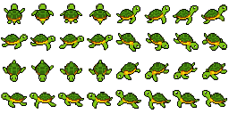

# turtliko.js

A little pixel turtle that swims after your mouse and blows bubbles.



This is a turtle take on [oneko.js](https://github.com/adryd325/oneko.js) by adryd.

## Usage

Download `turtliko.js` and `turtliko.png` and put them next to each other on your site.

Then add one line to your page:

```html
<script src="./turtliko.js"></script>
```

That's it.

## Options

Set options with data attributes on the script tag.

- `data-turtle`: path or URL of the sprite sheet. Default is `./turtliko.png`.
- `data-persist-position`: keep the turtle's position across page loads. Default is `true`.
- `data-bubbles`: show the bubbles. Default is `true`.

```html
<script src="/js/turtliko.js" data-turtle="/img/turtliko.png" data-persist-position="false" data-bubbles="false"></script>
```

## Behavior

- The turtle swims toward the mouse and leaves a trail of bubbles behind it.
- When it is close to the mouse, it paddles in place and blows a bubble now and then.
- It does not run for visitors who ask for reduced motion.
- Its position is saved in `localStorage` under the `turtliko` key when you leave the page.
- The turtle element has the id `turtliko`. Remove it from the page to stop the turtle.
- Bubbles have the class `turtliko-bubble` if you want to restyle them.

## Sprite sheet

`turtliko.png` is 256 x 128 pixels: 8 x 4 tiles of 32 x 32.

Each row holds two directions with four swim frames each: `N | NE`, `E | SE`, `S | SW`, `W | NW`.

## Demo

Open `index.html` in a browser.

## License

MIT. See [LICENSE](./LICENSE). Based on oneko.js, copyright (c) 2022 adryd.
